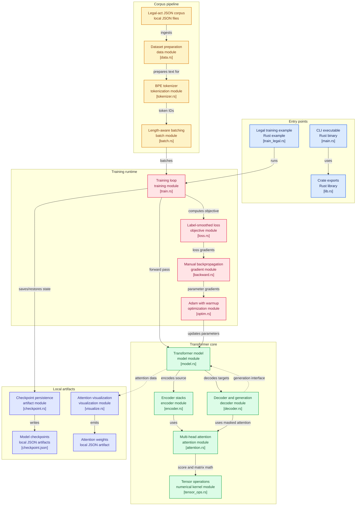

# Architecture Overview

## High-Level Model

```
Transformer
├── src_embeddings       [src_vocab, d_model]
├── tgt_embeddings       [tgt_vocab, d_model]  (shared w/ output projection)
├── positional_encoding  [max_len, d_model]    (sinusoidal)
├── encoder              Encoder
│   ├── N × EncoderLayer
│   │   ├── MultiHeadAttention (self-attention)
│   │   ├── FeedForward (2 linear layers + ReLU)
│   │   ├── LayerNorm (×2)
│   │   └── Residual connections
│   └── LayerNorm (final)
├── decoder              Decoder
│   ├── N × DecoderLayer
│   │   ├── MultiHeadAttention (masked self-attention)
│   │   ├── MultiHeadAttention (encoder-decoder cross-attention)
│   │   ├── FeedForward (2 linear layers + ReLU)
│   │   ├── LayerNorm (×3)
│   │   └── Residual connections
│   └── LayerNorm (final)
└── output_projection    Linear(d_model → tgt_vocab)
```

## Mathematical Operations (`tensor_ops.rs`)

| Operation | Implementation | Notes |
|-----------|---------------|-------|
| Matrix multiplication | Blocked 64×64 tiling | Cache-efficient, sequential |
| Softmax | Numerically stable | Subtracts row-wise max before exp |
| Layer normalization | Per-row normalization | ε=1e-6 |
| Dropout | Inverted dropout | Scales by 1/(1-p) during training |
| Embedding lookup | Row gather | O(1) per token |
| Xavier init | Glorot uniform | limit = sqrt(6/(fan_in+fan_out)) |
| Normal init | Box-Muller transform | For embedding initialization |

## Training Pipeline (`train.rs`)

The training loop implements the full forward → loss → backward → update cycle:

1. **Forward pass**: Embed tokens + add positional encoding → encoder stack → decoder stack (with cached activations) → output projection → logits
2. **Loss**: Label smoothing cross-entropy (ε=0.1 per Section 5.4)
3. **Backward pass**: Gradient computation through all layers using cached activations
4. **Gradient clipping**: Global norm clipped to 1.0
5. **Weight tying**: Output projection synchronized with target embeddings
6. **Adam update**: β₁=0.9, β₂=0.98, ε=1e-9 with warmup LR schedule

## LR Schedule (Equation 3)

```
lr = d_model^(-0.5) * min(step^(-0.5), step * warmup_steps^(-1.5))
```

## Data Pipeline

1. **Dataset loading**: Reads JSON files from `data/` directory
2. **BPE tokenization**: Trains a Byte Pair Encoding tokenizer on the text
3. **Sequence generation**: Creates (src, tgt_in, tgt_out) triples where:
   - `src` = tokenized text
   - `tgt_in` = BOS + src[:-1] (shifted input for decoder)
   - `tgt_out` = src (target output for loss)
4. **Bucket batching**: Groups sequences of similar length to minimize padding

## Performance Optimizations

- **Blocked matrix multiplication**: 64×64 tiling for L1 cache efficiency
- **Batch RNG in dropout**: Single RNG instance per dropout call (was per-element)
- **Numerically stable softmax**: Max-subtraction prevents overflow
- **Release build**: `opt-level=3` with link-time optimization
- **Weight tying**: Reduces parameters and improves generalization (Section 3.4)



